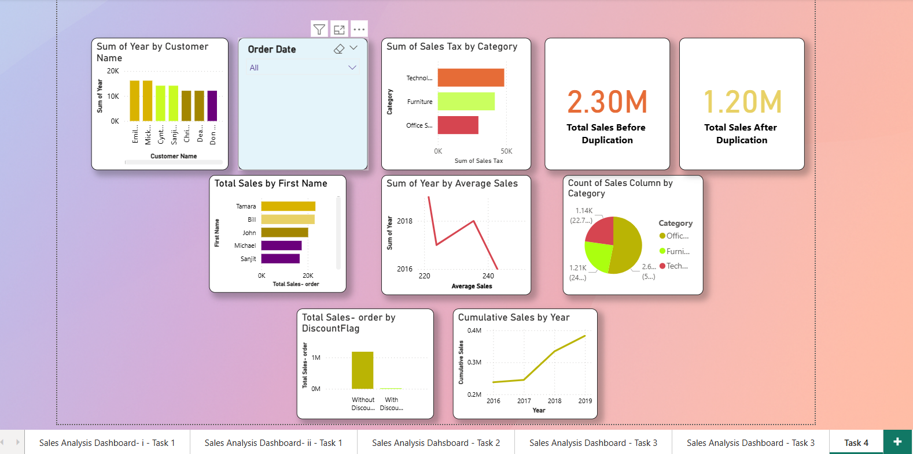
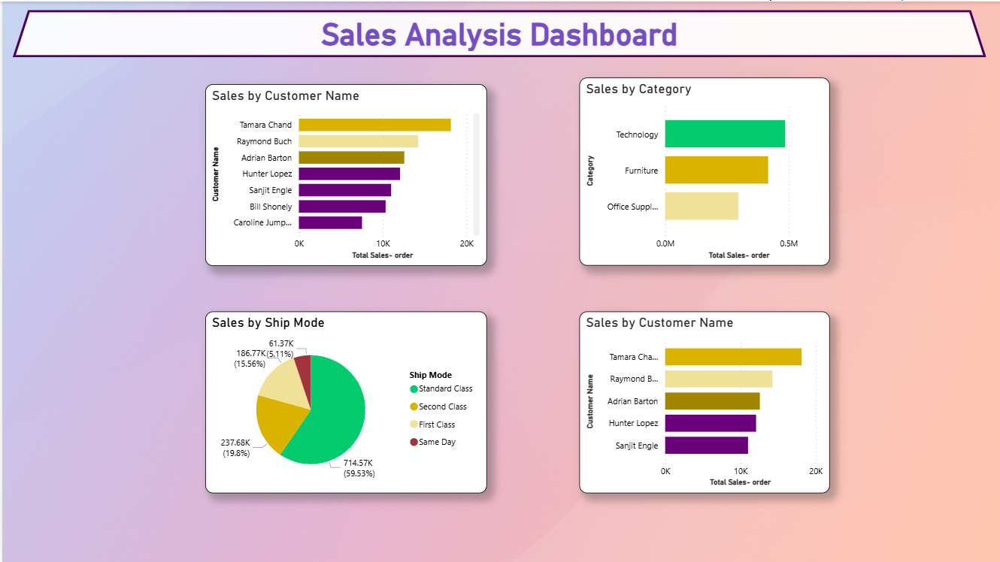
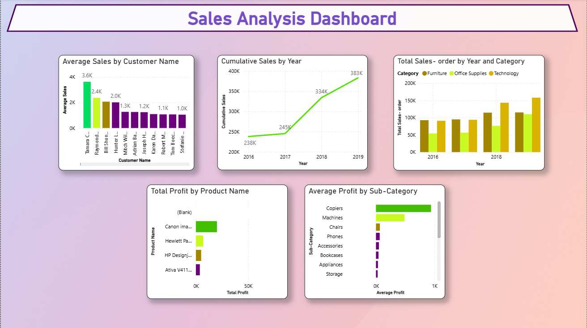
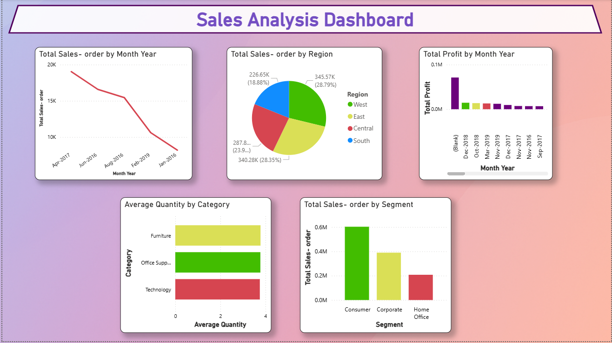
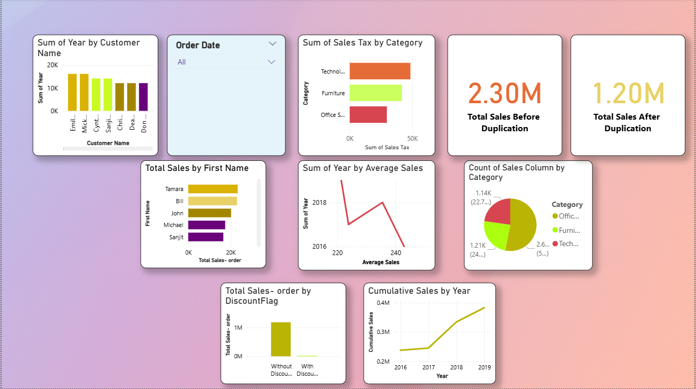

# Sales Analysis Dashboard

## Overview
This project presents a Sales Analysis Dashboard built to transform sales data into meaningful business insights through interactive visual reporting. The dashboard helps users track performance, monitor KPIs, and identify patterns in sales trends and category performance.

## Problem Statement
Businesses often struggle to understand sales performance from raw spreadsheets and static reports. This project solves that problem by creating a visual dashboard that makes it easier to analyze sales trends, compare categories, and support better decision-making.

## Objectives
- Build an interactive sales dashboard.
- Analyze sales performance across different categories and dimensions.
- Highlight important KPIs in a simple visual format.
- Improve reporting clarity for business users.
- Support data-driven business decisions.

## Tools Used
- Microsoft Power BI
- Microsoft Excel
- PDF documentation
- Dashboard visualization

## Dashboard Features
- Sales summary dashboard
- KPI cards and visual indicators
- Category or product performance tracking
- Interactive filters and slicers
- Easy-to-read reporting layout

## Files Included
- `dashboards/sales-analysis-dashboard.pbix` – Main Power BI dashboard file.
- `docs/problem-statement.pdf` – Problem statement and project explanation.
- `docs/task-2-documentation.pdf` – Supporting task documentation.
- `docs/task-4-documentation.pdf` – Additional project documentation.
- `screenshots/` – Dashboard preview images.

## Key Insights
- Visual dashboards make sales analysis faster and easier to understand.
- KPIs help quickly identify business performance trends.
- Category-level analysis helps reveal stronger and weaker performing segments.
- Interactive filtering improves exploration and focused reporting.

## Recommendations
- Use the dashboard to monitor performance regularly.
- Focus on high-performing categories and investigate low-performing ones.
- Add time-based trend analysis for better planning.
- Expand the dashboard with more business KPIs if needed.

## Repository Structure
```text
sales-analysis-dashboard-powerbi/
├── README.md
├── LICENSE
├── .gitignore
├── dashboards/
│   └── sales-analysis-dashboard.pbix
├── docs/
│   ├── task-2-documentation.pdf
│   └── task-4-documentation.pdf
├── screenshots/
│   ├── sales-analysis-dashboard-overview.png
│   ├── sales-analysis-dashboard-task2.png
│   ├── sales-analysis-dashboard-task3.png
│   └── sales-analysis-dashboard-task4.png
│   └── sales-analysis-dashboard-task5.png
```

## How to Use
1. Open the `.pbix` file in Microsoft Power BI Desktop.
2. Review the dashboard pages and visuals.
3. Use filters and slicers to explore the data.
4. Read the documentation files for project explanation and task details.

## Project Outcome
This project demonstrates skills in dashboard creation, business reporting, visual storytelling, and sales performance analysis using Power BI.

## Future Improvements
- Add time-series trend analysis.
- Include more detailed sales KPIs.
- Improve interactivity with advanced filters.
- Expand the dashboard for deeper business insights.

## Screenshots





